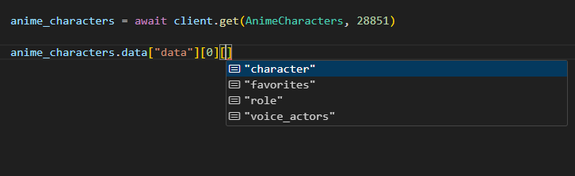
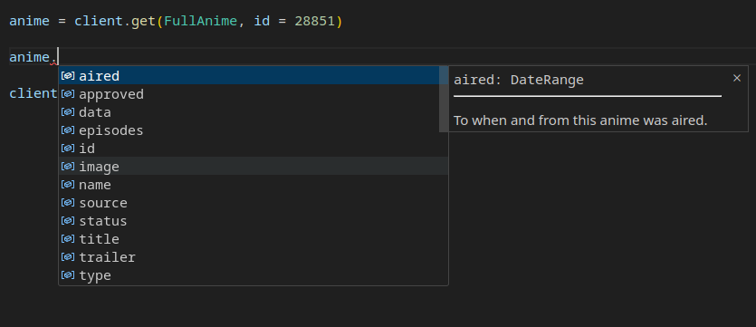
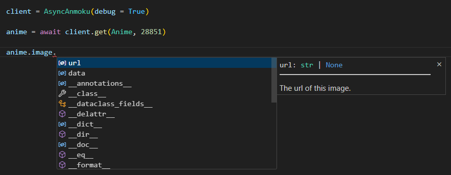

<div align="center">

  # Anmoku 安黙

  <sub>A peaceful and fully typed [MyAnimeList](https://myanimelist.net/) / [Jikan](https://jikan.moe/) Python API wrapper with caching and proper rate limiting.</sub>

  <br>

  

  <br>

</div>

> [!NOTE]
> 
> Anmoku is currently a work in progress so the features below may not be complete yet or experimental.

## Features ✨
- [x] Rate limiting 🎀 (with actual waiting).
- [ ] Supports caching. ⚡
- [ ] [Fully type hinted.](#type-hinting-support-) 🌌 ~~*yes you heard me correctly*~~

## Examples ⚗️
Anmoku is probably the simplest Jikan API wrapper you'll ever use. All you need is the client and the resource. 🌊
```python
from anmoku import Anmoku, AnimeCharacters

client = Anmoku(debug = True)

anime_characters = client.get(AnimeCharacters, id = 28851) # ID for the anime film "A Silent Voice".

for character in anime_characters:
    print(f"{character.name} ({character.url})")

client.close()
```
We also have an async client:
```python
import asyncio
from anmoku import AsyncAnmoku, AnimeCharacters

async def main():

    client = AsyncAnmoku(debug = True)

    anime_characters = await client.get(AnimeCharacters, id = 28851) # ID for the anime film "A Silent Voice".

    for character in anime_characters:
        print(f"{character.name} ({character.url})")

    await client.close()

asyncio.run(main())
```

#### Output:
```sh
[DEBUG] (anmoku) - [AsyncAnmoku] GET --> https://api.jikan.moe/v4/anime/28851/characters
Ishida, Shouya (https://myanimelist.net/character/80491/Shouya_Ishida)
Nishimiya, Shouko (https://myanimelist.net/character/80243/Shouko_Nishimiya)
Headteacher (https://myanimelist.net/character/214351/Headteacher)
Hirose, Keisuke (https://myanimelist.net/character/97569/Keisuke_Hirose)
Ishida, Maria (https://myanimelist.net/character/97943/Maria_Ishida)
Ishida, Sister (https://myanimelist.net/character/118723/Sister_Ishida)
# ... more characters below but I cut them off for the convenience of this readme
```

### Searching! 🤩
Here are some searching examples you can try:
```python
from anmoku import Anmoku, Character

client = Anmoku(debug = True)

characters = client.search(Character, "anya forger")

for character in characters:
    print(f"{character.name} ({character.image.url})")

client.close()
```
Merge that with gradio and you have a GUI.
https://github.com/THEGOLDENPRO/anmoku/blob/099f6596b685daa65259319d6730bef674ced38a/examples/gradio_anime_search.py#L1-L23

[[Gradio Video]](https://github.com/THEGOLDENPRO/anmoku/assets/66202304/75c9c35c-bf68-4c53-96e5-057dc97ca1dd)

## Type hinting support! 🌌
API responses in our library are strongly typed.



On top of that, we even provide class interfaces if you wish for stability and ease of use.




<br>

<div align="center">

  

  <sub>*Python's future Jikan API wrapper.*</sub>

</div>
